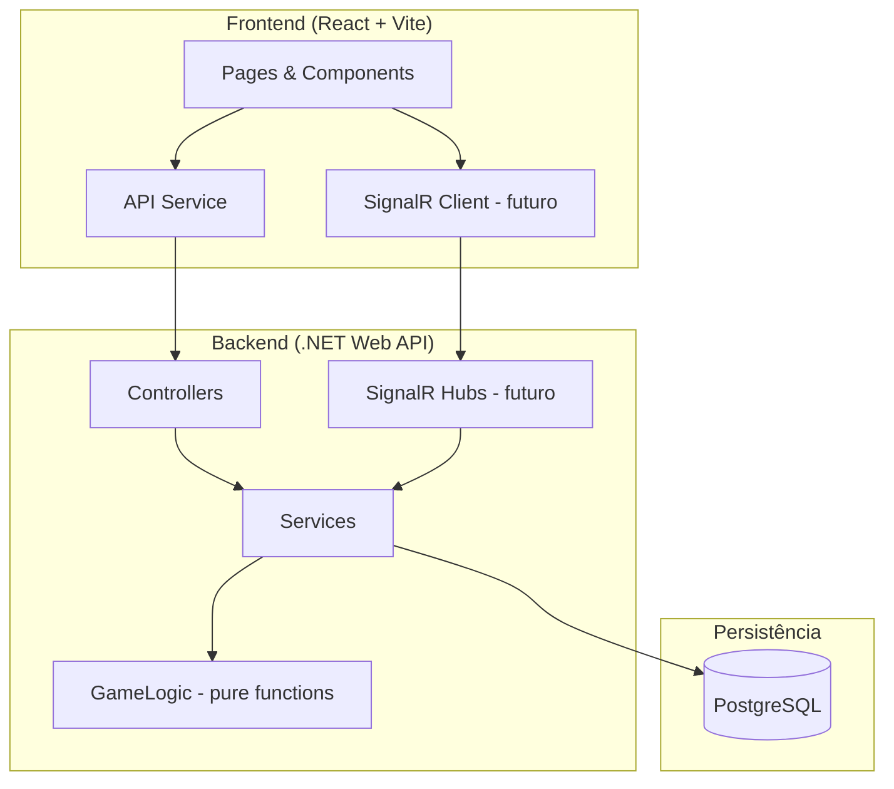
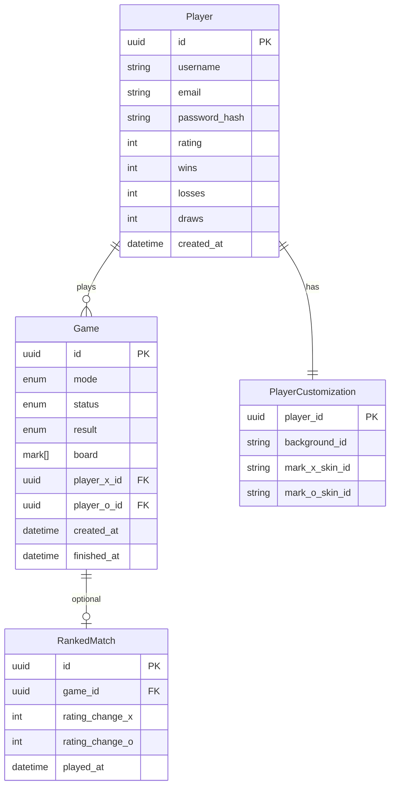
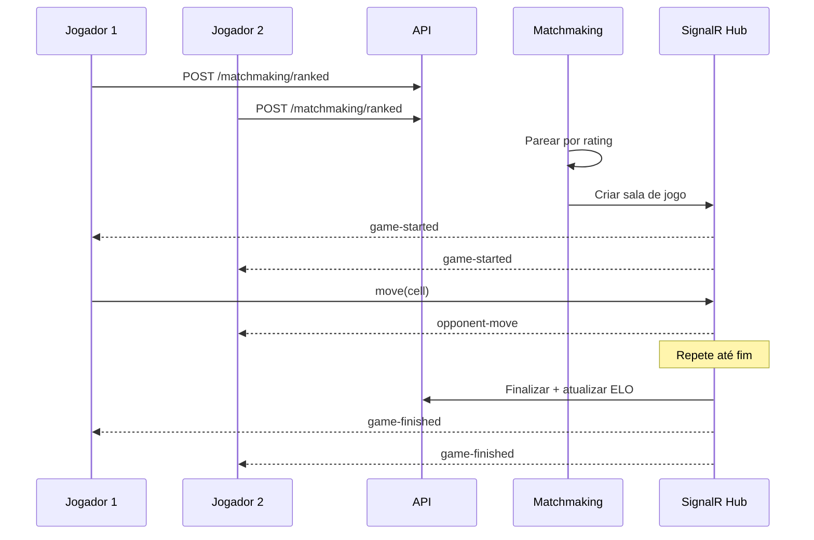

# Arquitetura — Tic Tac Toe League

## Diagrama de alto nível

## Camadas do backend

### Controllers

Responsáveis apenas por:

- Validação de entrada (model binding)
- Autenticação/autorização (`[Authorize]`)
- Mapeamento HTTP ↔ DTOs
- Códigos de status HTTP

### Services

- `IAuthService` — registro, login, hash de senha
- `IGameService` — criar partida, aplicar jogadas, finalizar
- `IRankingService` — cálculo ELO, histórico ranqueado
- `ICustomizationService` — persistir preferências visuais
- `IAiOpponentService` — escolha de jogada da IA

### GameLogic

Funções puras sem I/O. Testáveis unitariamente:

- `IsValidMove`
- `GetResult`
- `Opponent`

## Modelo de dados (planejado)

## Fluxo de partida ranqueada

## Frontend — estrutura de rotas (planejada)

| Rota            | Página        | Auth |
|-----------------|---------------|------|
| `/`             | Home/Lobby    | Opcional |
| `/login`        | Login         | Não  |
| `/register`     | Registro      | Não  |
| `/play/ai`      | vs IA         | Sim  |
| `/play/casual`  | PvP casual    | Sim  |
| `/play/ranked`  | Fila ranqueada| Sim  |
| `/profile`      | Perfil + skins| Sim  |
| `/leaderboard`  | Ranking global| Não  |

## Segurança

- Senhas: **BCrypt** ou **ASP.NET Identity PasswordHasher**
- JWT com expiração curta + refresh token (fase 2)
- CORS restrito ao origin do frontend em produção
- Rate limiting em auth e matchmaking

## Infra local

- `docker-compose.yml` — PostgreSQL 16
- Connection string em `appsettings.Development.json` ou User Secrets
- Frontend proxy via Vite em desenvolvimento

## Decisões técnicas pendentes

| Decisão              | Opções                         | Recomendação     |
|----------------------|--------------------------------|------------------|
| ORM                  | EF Core / Dapper               | EF Core          |
| Auth                 | Identity / JWT manual          | ASP.NET Identity |
| IA                   | Minimax / Monte Carlo          | Minimax          |
| State management FE  | Context / Zustand / TanStack   | Context + hooks  |
| UI library           | CSS puro / Tailwind / shadcn   | A definir        |
